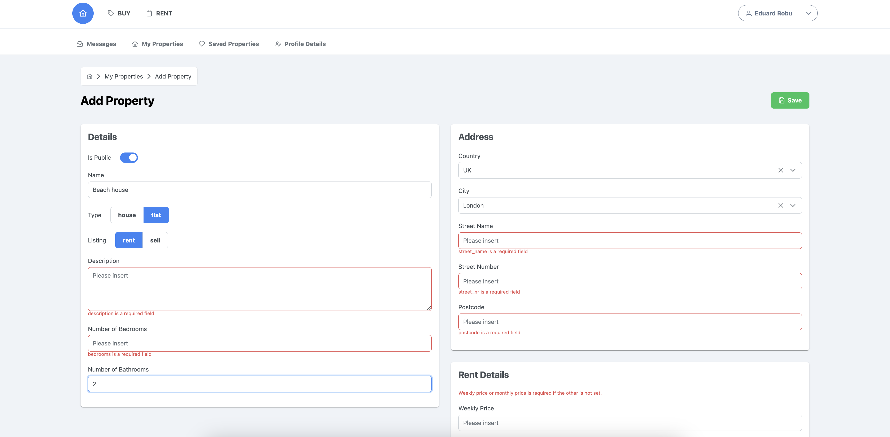

## Properties SPA Project - Work in progress...

Technologies used in the project:

- Vue.js 3
- Pinia
- TypeScript
- Vue Router
- Tailwind CSS
- PrimeVue 

## How to use it

1. Install the Properties API project first and return here
2. Run `npm install`
3. Run `npm run dev`

### Web UI

Go to http://localhost:5173/

### Screenshot

## License

Copyright (C) Eduard Cristian Robu - All Rights Reserved

This file is part of Properties project

Properties project can not be copied and/or distributed without the express permission of Eduard Cristian Robu

Written by Eduard Cristian Robu <robu.edi.office at gmail.com>, 2023

Eduard Cristian Robu works as a contractor, for any enquiries please contact using the <robu.edi.office at gmail.com> email address 

