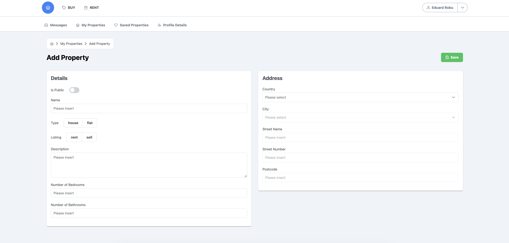

## Properties SPA Project - Work in progress...

Technologies used in the project:

- Laravel 10 - PHP8.2
- Vue.js 3
- Pinia
- Vue Router
- Tailwind CSS
- PrimeVue 

## How to use it

1. Install Docker
2. Run `sail up -d`
3. Run `sail composer install`
4. Run `sail artisan db:seed`

### Web UI

Go to http://localhost

### API documentation 

Go to http://localhost/api/documentation#/

### PHPUnit

Run `sail test`

### Screenshot

## License

Copyright (C) Eduard Cristian Robu - All Rights Reserved

This file is part of Properties project

Properties project can not be copied and/or distributed without the express permission of Eduard Cristian Robu

Written by Eduard Cristian Robu <robu.edi.office at gmail.com>, 2023

Eduard Cristian Robu works as a contractor, for any enquiries please contact using the <robu.edi.office at gmail.com> email address 

